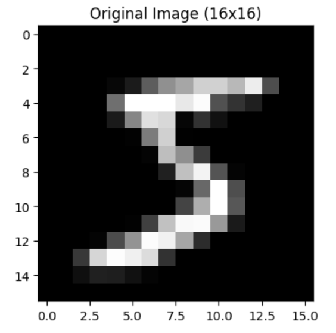
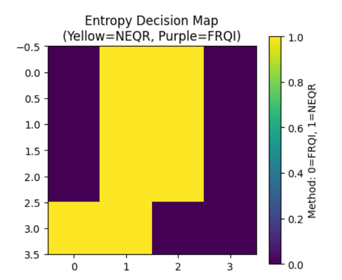

# ⚛️ EBA-HQR: Entropy-Based Adaptive Hybrid Quantum Representation


## 📄 Abstract
This repository hosts the implementation of **Entropy-Based Adaptive Hybrid Quantum Representation (EBA-HQR)**, a novel quantum image processing algorithm designed to optimize the trade-off between circuit depth and image fidelity.

Traditional Quantum Image Processing (QIP) methods typically rely on:
* **NEQR (Novel Enhanced Quantum Representation):** High precision but exponentially high qubit cost ($O(2^{2n})$).
* **FRQI (Flexible Representation of Quantum Images):** Low qubit cost ($O(\log N)$) but suffers from complexity in retrieving precise color values.

**EBA-HQR bridges this gap.** By utilizing **Shannon Entropy** as a decision metric, the algorithm dynamically segments an image into "Regions of Interest" (High Entropy) and "Background" (Low Entropy), allocating expensive quantum resources (NEQR) only where strictly necessary.

---

## 🚀 Key Innovation
The core novelty lies in the **Adaptive Decision Mechanism**:
1.  **Block Segmentation:** The image is divided into $4 \times 4$ sub-blocks.
2.  **Entropy Analysis:** Shannon Entropy $H$ is calculated for each block to measure information density.
3.  **Dynamic Encoding:**
    * **If $H > \alpha$ (Threshold):** The block is encoded using **NEQR** (Basis Encoding) to preserve edges and details.
    * **If $H \le \alpha$:** The block is compressed using **FRQI** (Amplitude Encoding) to save quantum resources.

---

## 📸 Screenshots & Results

| **1. Real Data Input** | **2. Entropy Decision Map** |
| :---: | :---: |
|  |  |
| *Real MNIST Digit (16x16)* | *Yellow = High Detail (NEQR), Purple = Compressed (FRQI)* |

> **Analysis:** The segmentation map clearly isolates the digit '5' (high information) from the background, proving the algorithm successfully identifies Regions of Interest.

---

## 🛠️ Installation & Setup

### Prerequisites
* Python 3.8+
* An IBM Quantum Account (for real hardware execution)

### Step 1: Clone the Repository
```bash
git clone [https://github.com/TanishaDebnath/quantum_image_processing.git](https://github.com/TanishaDebnath/quantum_image_processing.git)
cd quantum_image_processing

```

### Step 2: Install Dependencies

```bash
pip install -r requirements.txt

```

### Step 3: Run the Application

```bash
streamlit run app.py

```

---

## ⚙️ Features

* **Real-Time Thresholding:** Adjust the entropy threshold  via a slider to visualize how compression changes dynamically.
* **Dual Backend Support:**
* 💻 **Local Simulator:** Uses `Qiskit Aer` for instant validation and debugging.
* ☁️ **IBM Quantum Cloud:** Seamless integration with IBM's QPU fleet (e.g., `ibm_brisbane`) for real hardware deployment.


* **Hybrid Data Pipeline:** Supports both the standard **MNIST Dataset** (pre-loaded) and **Custom Image Uploads** (e.g., Medical MRI/X-Ray).

---

## 🧠 Methodology (Mathematical Formulation)

For a block  of pixels, the Shannon Entropy is defined as:

$$ H(B) = - \sum_{i=0}^{255} p(i) \log_2 p(i) $$

Where  is the probability of pixel intensity  occurring in the block.

The decision function  determines the encoding strategy:

---

## 📂 Project Structure

* `app.py`: Main application logic containing the EBA-HQR algorithm and Streamlit UI.
* `mnist_data.npz`: Compressed subset of real MNIST data for offline loading.
* `requirements.txt`: List of dependencies.

---

## 👩‍💻 Author

**Tanisha Debnath**

* *Dept. of Computer Science & Engineering (AI Specialization)*
* *Institute of Engineering and Management (IEM), Kolkata*

---


